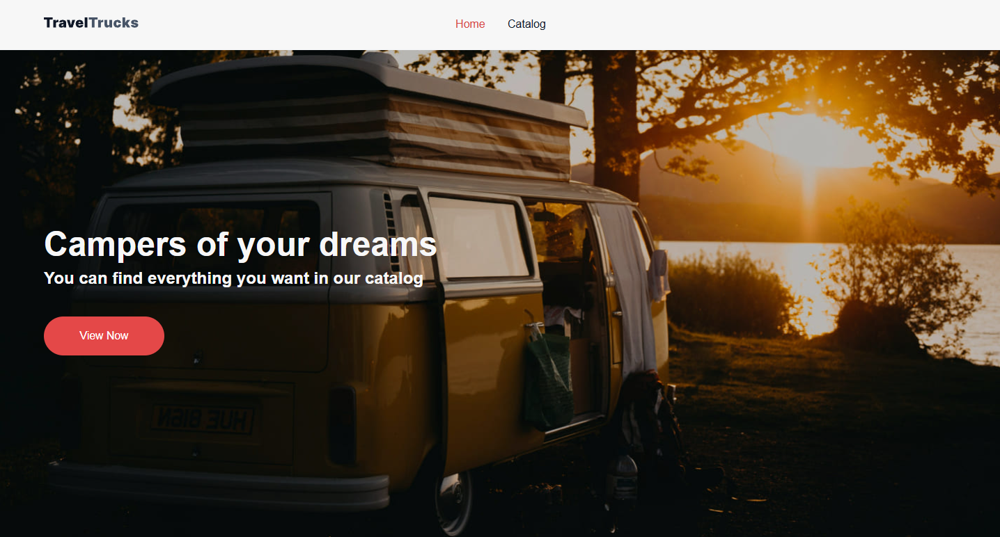
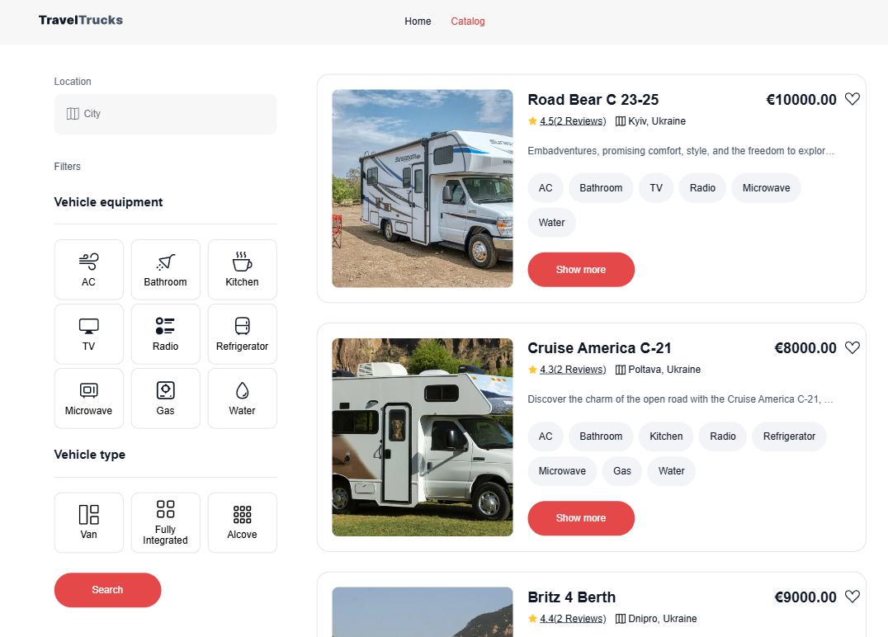
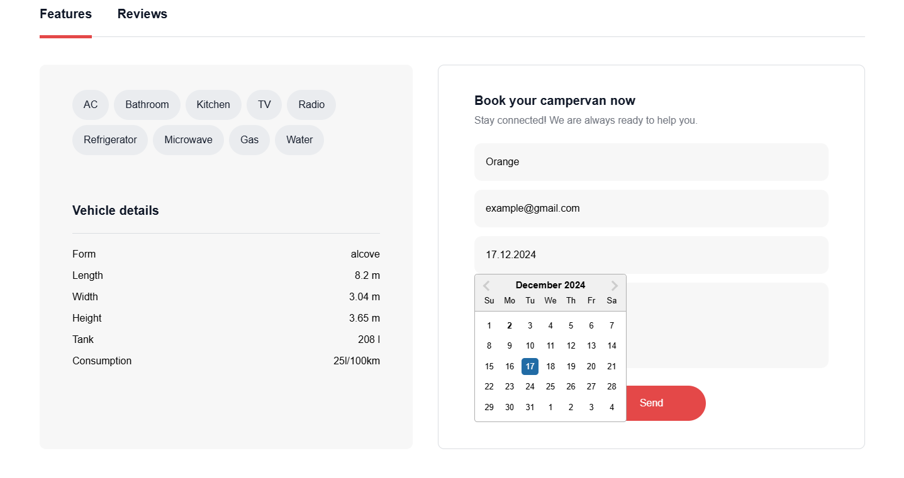
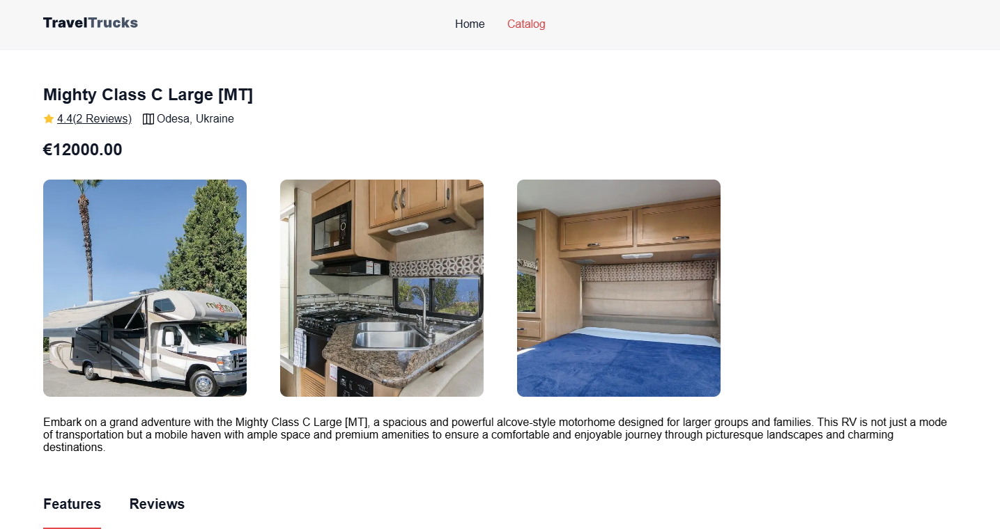

# TravelTrucks

**TravelTrucks** is a project for finding campers for travel. Users can search for available campers based on location, preferred camper type, and amenities (such as shower, kitchen, TV, etc.).

## Main Features

- Search for campers by filters: location, camper type, and equipment.
- View a list of available campers and see more details.
- Pagination and filtering of the camper list.
- Ability to book a camper through a contact form (providing name, email, and desired booking date).
- A page with detailed information about the selected camper (features, reviews).

## Live Page

[TravelTrucks - Website](https://travel-trucks-project-amber.vercel.app/)

## Technologies

The project uses the following technologies and tools:

- **React** — for building the user interface.
- **Redux** — for state management.
- **Axios** — for making HTTP requests.
- **React Router** — for routing between pages.
- **CSS Modules** — for styling components.

## Installation

To install the project on your local machine, follow these steps:

1. Clone the repository:

   ```bash
   git clone https://github.com/AliaNord/travel-trucks-project.git
   ```

2. Navigate to the project directory:

   ```bash
   cd travel-trucks-project
   ```

3. Install the dependencies:
   ```bash
   npm install
   ```
4. Start the project:
   ```bash
   npm run dev
   ```

## Usage

Once the project is running, the following steps guide you through its use:

1. On the Home tab, you will see a welcome message.
2. Go to the Catalog section to browse the list of available campers. You can use filters to adjust your search.
3. To learn more about a camper, click the Show more button on the camper card to navigate to the detailed camper page.
4. The camper page has two tabs:

   - **Features** — detailed information about the camper's characteristics.
   - **Reviews** — user reviews.

5. To book a camper, fill out the contact form with your name, email, and desired booking date.

## Screenshots









## Author

Project Author: [AliaNord - GitHub](https://github.com/AliaNord)

Contact Email: alina.yevrushenko8@gmail.com
``
